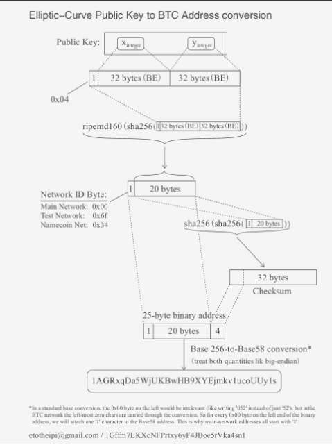
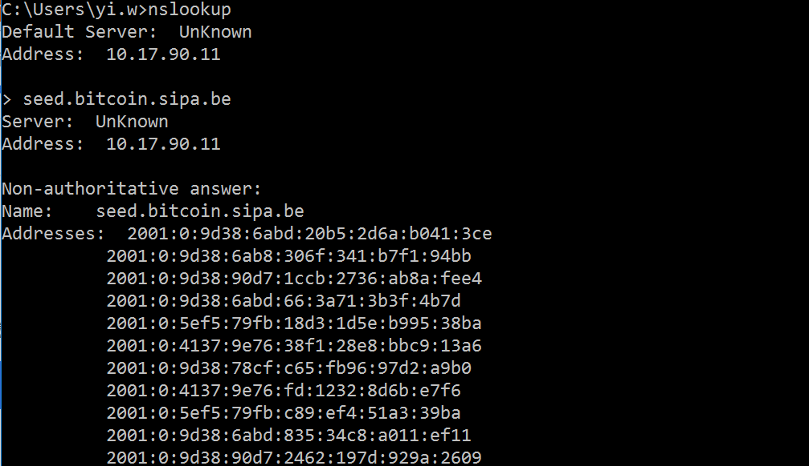

# Bitcoin原理與實作

## #錢包

```
錢包裡面含有多個Bitcoin Address以及公私鑰
```

錢包加密SourceCode: [https://github.com/bitcoin/bitcoin/blob/af563971fcbece3659f501329afa9dc84ed733b2/src/wallet/crypter.cpp](https://github.com/bitcoin/bitcoin/blob/af563971fcbece3659f501329afa9dc84ed733b2/src/wallet/crypter.cpp)

[https://en.bitcoin.it/wiki/Wallet\_encryption](https://en.bitcoin.it/wiki/Wallet\_encryption)

## #產生公鑰和私鑰與比特幣地址



```
十六進制hex每個字為4 bits也就是0.5bytes
```

以下使用node.js實作\
先安裝`npm install bs58`

base58說明:[https://zh.wikipedia.org/wiki/Base58](https://zh.wikipedia.org/wiki/Base58)

```
var crypto = require('crypto');
var ecdh = crypto.createECDH('secp256k1');


var hash2 = crypto.randomBytes(32)
console.log('--------')
console.log('私鑰')
console.log(hash2); //私鑰，64位十六進制數   //使用hash2.toString('hex')即可看到16進位字串
console.log('--------')


// ECDH和ECDSA產生公私鑰的方式都相同
var publickey = ecdh.setPrivateKey(hash2,'hex').getPublicKey('hex')
console.log('公鑰')
console.log(publickey); //公鑰(通過橢圓曲線算法可以從私鑰計算得到公鑰)
console.log('--------')

//把公鑰以sha256加密後再用ripemd160加密，取得publickeyHash
var hash = crypto.createHash('sha256').update(publickey).digest();
hash = crypto.createHash('ripemd160').update(hash).digest();
console.log('publickeyHash')
console.log(hash);
console.log('--------')


//在publickeyHash前面加上一个00前缀
var version = new Buffer('00', 'hex');
var checksum = Buffer.concat([version, hash]);
//兩次256雙重加密
checksum = crypto.createHash('sha256').update(checksum).digest();
checksum = crypto.createHash('sha256').update(checksum).digest();

//取前4位得到效驗碼
checksum = checksum.slice(0, 4);
console.log('checksum')
console.log(checksum);
console.log('--------')

//把publickeyHash前面一樣加上00而後面加上剛才算出的checksum
var address = Buffer.concat([version, hash, checksum]);
console.log('編碼前地址')
console.log(address);
console.log('--------')


var bs58 = require('bs58');
address = bs58.encode(address);
console.log('編碼後的比特幣地址')
console.log(address);
console.log('--------')
```

## #genesis block

也稱為創世區塊，為區塊鏈在一開始產生時的區塊

比特幣的：\
[https://blockchain.info/block/000000000019d6689c085ae165831e934ff763ae46a2a6c172b3f1b60a8ce26f](https://blockchain.info/block/000000000019d6689c085ae165831e934ff763ae46a2a6c172b3f1b60a8ce26f)

其擁有以下結構

```
4字節    版本    版本號，用於跟踪軟件/協議的更新
32字節   父區塊哈希值    引用區塊鏈中父區塊的哈希值
32字節   Merkle根    該區塊中交易的merkle樹根的哈希值
4字節    時間戳    該區塊產生的近似時間（精確到秒的Unix時間戳）
4字節    難度目標    該區塊工作量證明算法的難度目標
4字節    Nonce    用於工作量證明算法的計數器
```

bitcoin genesis 創建的原始碼\
[https://github.com/bitcoin/bitcoin/blob/3955c3940eff83518c186facfec6f50545b5aab5/src/chainparams.cpp#L123](https://github.com/bitcoin/bitcoin/blob/3955c3940eff83518c186facfec6f50545b5aab5/src/chainparams.cpp#L123)

## #Merkle tree

區塊鏈中的每個區塊都包含了產生於該區塊的所有交易，且以Merkle樹表示


他是把每一筆資料的txid用兩次sha256做加密

```
HA =  SHA256(SHA256(交易A))
```

```
HB =  SHA256(SHA256(交易B))
```

然後再把兩個字串連結再一起，之後再繼續做一樣的加密，直到出現Merkel根為止

ex:

```javascript
var crypto = require('crypto');

const tx1 = '51b78168d94ec307e2855697209275d477e05d8647caf29cb9e38fb6a4661145';
const tx2 = 'dasd94ec307e2855697209275d477e05d8647caf29cb9e38fb6a4661145ddddd';

const tx3 = 'b45ff1f1aa88de71005fd14487328cbc74bc47fd783aa6734c1e4c7950962cc4';
const tx4 = 'caede6064e49b54ae53ac44fadd01e66be907f1bbd1daedd8b3f3f9561447f4f';

function crypto256(input) {
    var final = crypto.createHash('sha256')
        .update(input)
        .digest('hex');
    return final
}

var hash1 = crypto256(crypto256(tx1));
var hash2 = crypto256(crypto256(tx2));

var hash3 = crypto256(crypto256(tx3));
var hash4 = crypto256(crypto256(tx4));


var hash1_hash2 = crypto256(crypto256(hash1 + hash2));
var hash3_hash4 = crypto256(crypto256(hash3 + hash4));

var root = crypto256(crypto256(hash1_hash2 + hash3_hash4));

console.log('Merkle Root為:' + root);
```

## #挖礦

在挖礦過程中成功“挖出”新區塊的礦工可以得到該區塊中包含的所有交易手續費。目前，這筆費用占礦工收入的0.5%或更少，大部分收益仍來自挖礦所得的比特幣獎勵

可以先參考此網站\
[http://www.yogh.io/#mine:last](http://www.yogh.io/#mine:last)

他會用區塊頭

```
Version: 536870912
Prev block: 0000000000000000008D8AF3B55F92BFFEBF286D9C87C54F80C780224F8DD06C
Merkle root: AA5FB4AFB0154D2BDD3315E074F219351FDF13908F1C515E07BE12124A3D3760
Timestamp: February 16, 2017, 17:35:35 +0800
Bits: 18029AB9
Nonce: 一個隨機數
```

來做兩次sha256加密，只要比一個target數小，及為挖到新的區塊

```
var crypto = require('crypto');


function crypto256(input) {
  var final = crypto.createHmac('sha256', input)
                    .update('test')
                    .digest('hex');
  return final
} 

var hash1 = (header) => crypto256(crypto256(header));

var nonce = 0;
while(1) {
  nonce += 1;

  var header = {
      nonce: nonce,
      previousHash: "dd0e2b79d79be0dfca96b4ad9ac85600097506f06f52bb74f769e02fcc66dec6",
      merkleRoot: "c91c008c26e50763e9f548bb8b2fc323735f73577effbc55502c51eb4cc7cf2e",
      TimeStamp: new Date()
  };
  var cal = hash1(JSON.stringify(header));
  console.log(cal);
  if (parseInt(cal, 16) < parseInt("0000FFFFFFFFFFFFFFFFFFFFFFFFFFFFFFFFFFFFFFFFFFFFFFFFFFFFFFFFFFFF", 16)) {
    console.log("success: " + cal);
    console.log("counts for:" + nonce + ' tiems')
    break;
  }

}
```

礦工挖礦的獎勵為區塊第一筆交易，通常被稱為coinbase，它沒有輸入，所以TxIn的Hash總是被標記為00000000...0000


你可能會想說為什麼不直接給小於某一個數字就好了為何還要慢慢算呢，因為算出來後要給別人驗證你已經算出來的話你必須給別人本文，也就是加密前的東西，讓別人用你的本文加密，來確認真的可以用這個本文算出特定hash

> 可能會有兩個節點同時算出區塊，這時兩個區塊會廣播自己算出的區塊給鄰近節點，此時會產生兩個分支，這時下一個算出區塊的分支會再次廣播他算出的區塊，而另一個分支接收到後會發現有其他更長的分支，就會拋棄原先的分支來繼續算目前最長分支的下一個區塊
>
> [https://en.bitcoin.it/wiki/Confirmation](https://en.bitcoin.it/wiki/Confirmation)

## #廣播與驗證交易

[https://en.bitcoin.it/wiki/Protocol\_rules#.22tx.22\_messages](https://en.bitcoin.it/wiki/Protocol\_rules#.22tx.22\_messages)

發出交易後發出者會帶上用私鑰與相關交易訊息hash過的值，而發出的script包含公鑰，之後其他節點要驗證交易時就用這個公鑰看能不能解開即可

意思為用發出者的公鑰解開他用私鑰加密後的東西即為交易本文

(即為ECDSA的verify過程)

> 發出的交易經過六個確認(納入六個區塊後)金額才可繼續被交易
>
> 主要是避免Double spend(發出同樣的交易兩次)

## #難度difficulty的更改

[https://en.bitcoin.it/wiki/Difficulty](https://en.bitcoin.it/wiki/Difficulty)

難度在每2016個block被挖出後會自動按照公式更改一次

````
1.使用Bitcoin API getDifficulty取得現在的難度
https://blockexplorer.com/api/status?q=getDifficulty

2.
從難度去反推(利用公式)現在要計算的Target
https://en.bitcoin.it/wiki/Difficulty
```
0x00000000FFFF0000000000000000000000000000000000000000000000000000 /
0x00000000000404CB000000000000000000000000000000000000000000000000  
= 16307.420938523983 (bdiff)
```

3.難度調整的公式為

```
old_difficulty*(2 weeks)/(time the past 2015 blocks took)

```
https://bitcoin.stackexchange.com/questions/855/what-keeps-the-average-block-time-at-10-minutes

寫在原始碼中main.cpp的GetNextWorkRequired
https://dev.visucore.com/bitcoin/doxygen/pow_8cpp.html#a444323ddc75c2b90f484fa9b9da31dc8

https://bitcoin.stackexchange.com/questions/1212/how-do-the-clients-agree-on-the-target-to-hash-for

4.之後經過block hash(挖礦)
https://en.bitcoin.it/wiki/Block_hashing_algorithm

最後成功算出的礦工即可以獲得獎勵，獎勵的錢及為下一個區塊的coinbase

5.算出來的hash及為下一個區塊的block hash
````

```
假設在區塊277,316中，它的值為 0x1903a30c。分為前兩位十六進位數字，與後面的六位。在這個區塊裡，0x19為前兩位，而 0x03a30c 為後六位。

計算難度目標的公式為：
 target = coefficient * 2^(8 * (exponent – 3))
由此公式及難度位的值 0x1903a30c，可得：
target = 0x03a30c * 2^(0x08 * (0x19 - 0x03))

=> target = 0x03a30c * 2^(0x08 * 0x16)

=> target = 0x03a30c * 2^0xB0
按十進位計算為：
=> target = 238,348 * 2^176
=> target =
22,829,202,948,393,929,850,749,706,076,701,368,331,072,452,018,388,575,715,328
轉為十六進制後為：
=> target =0x0000000000000003A30C00000000000000000000000000000000000000000000
```

## Hash Rate

```
 1 KHash/s = 1000 Hash/s
 1 MHash/s = 1000 KHash/s
 1 GHash/s = 1000 MHash/s
 1 THash/s = 1000 GHash/s
 1 PHash/s = 1000 THash/s

 所以 1 PHash/s = 1000000000000000 Hash/s
```

也可以用以下網站來估計

[http://bitcoin.web-share.nl/](http://bitcoin.web-share.nl)

先到[https://blockchain.info/charts/hash-rate](https://blockchain.info/charts/hash-rate) 查看現在平均的算力

然後填入，他就會幫你計算相關數據


## #從TXid hash找出某筆交易詳細訊息

會有一個HASH表，所以用很短的時間複雜度即可從hash對應到直接的資訊，也因為這些txid的hash之後會在兩兩加密為merkel tree 並將merkel root 存在block中，所以就算可以看到資訊也不怕被修改，具有hash通常都有hash table可以查到它裡面對應的值

## #新加入節點如何找到其他節點

利用寫在原始碼的DNS seed

> The [DNS seeds](https://bitcoin.org/en/glossary/dns-seed)are maintained by Bitcoin community members
>
> [Nodes](https://bitcoin.org/en/glossary/node)are added to the [DNS seed](https://bitcoin.org/en/glossary/dns-seed)if they run on the default Bitcoin ports of 8333 for [mainnet](https://bitcoin.org/en/glossary/mainnet)or 18333 for [testnet](https://bitcoin.org/en/glossary/testnet).

[https://github.com/bitcoin/bitcoin/blob/aab1e55860dea1e40fc02bc0e535c1d1474a5ae3/src/chainparams.cpp](https://github.com/bitcoin/bitcoin/blob/aab1e55860dea1e40fc02bc0e535c1d1474a5ae3/src/chainparams.cpp) 124行

其他回答可參考[http://bitcoin.stackexchange.com/questions/3536/how-do-bitcoin-clients-find-each-other](http://bitcoin.stackexchange.com/questions/3536/how-do-bitcoin-clients-find-each-other)

使用`nslookup`來查看提供的url會回覆一串IP address


