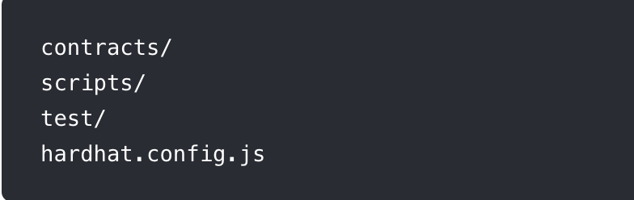

# Hardhat 教學

類似 Truffle 為一個智能合約開發 SDK。



### 專案結構



必須照著官方規定取名資料夾，分別為放合約以及部署script，與測試檔案，以及網路等 config。

[https://hardhat.org/guides/project-setup.html\#sample-hardhat-project](https://hardhat.org/guides/project-setup.html#sample-hardhat-project)

### 在本地測試與部屬

1. 啟動本地節點

```text
npx hardhat node
```

2.部署合約

```text
npx hardhat run --network localhost scripts/deploy.js
```

3.使用 console 測試功能

```text
npx hardhat console --network localhost
```

之後輸入

```text
const Greeter = await ethers.getContractFactory("Greeter");
```

```text
const greeter = await Greeter.attach(<剛才部署本地的合約地址>);
```

```text
await greeter.greet()
```

### 寫測試檔案

test/test.js

```javascript
const { expect } = require("chai");
const { ethers } = require("hardhat");

describe("Greeter12", function () {
  it("Should return the new greeting once it's changed", async function () {
    
    const Greeter = await ethers.getContractFactory("Greeter");
    // const greeter = await Greeter.deploy("Hello, world!");
    // await greeter.deployed();

    //expect(await greeter.greet()).to.equal("Hello, world!");
    const greeter = await Greeter.attach("0x5FbDB2315678afecb367f032d93F642f64180aa3");

    const setGreetingTx = await greeter.setGreeting("Hola, mundo!");

    // wait until the transaction is mined
    await setGreetingTx.wait();
    const a = await greeter.greet()
    //console.log(a)

    expect(await greeter.greet()).to.equal("Hola, mundo!");
  });
});

```

之後輸入

```text
npx hardhat test --network localhost
```

## Artifacts

部署合約或 compile 後會產生此資料夾，裡面包含一些 json 檔案，為合約的 ABI

[https://hardhat.org/guides/compile-contracts.html\#compiling-your-contracts](https://hardhat.org/guides/compile-contracts.html#compiling-your-contracts)

