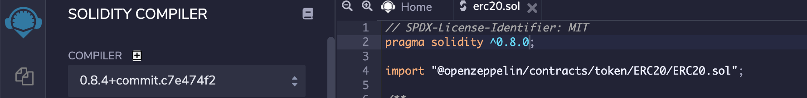

# OpenZeppelin 合約 library



## 繼承方法

使用 is 繼承，之後可以使用其內的方法，直接呼叫。

[https://docs.openzeppelin.com/contracts/2.x/api/token/erc721](https://docs.openzeppelin.com/contracts/2.x/api/token/erc721)

```javascript
import "@openzeppelin/contracts/access/Ownable.sol";
import "@openzeppelin/contracts/token/ERC721/extensions/ERC721Enumerable.sol";
import "@openzeppelin/contracts/utils/Strings.sol";

contract Test is ERC721Enumerable, ReentrancyGuard, Ownable {
 ....
}

```

## 使用 Remix



或是


