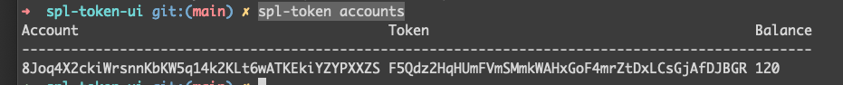

# Solana 教學

## 安裝

```text
1. sh -c "$(curl -sSfL https://release.solana.com/v1.5.8/install)"

2. 加入環境變數到 ~/.zshrc
vim ~/.zshrc
export PATH="/Users/easonwang/.local/share/solana/install/active_release/bin:$PATH"
```

## 使用

查看目前設置：

```text
solana config get
```

## SPL Token Program

solana 的預設 library 之一，方面我們創建 token 相關的應用。

#### 安裝

```text
cargo install spl-token-cli
```

#### 改變網路環境

```text
solana config set --url https://testnet.solana.com
```

#### 創建新的 account keypair

```text
solana-keygen new
```

之後會產生 /Users/easonwang/.config/solana/id.json 即為你的 private key，可以引入 sollet 網頁錢包。

#### 創建一個 mint token

```text
spl-token create-token

// 出現如下
// Creating token F5Qdz2HqHUmFVmSMmkWAHxGoF4mrZtDxLCsGjAfDJBGR
```

創建這個 mint token 下的 account

```text
spl-token create-account F5Qdz2HqHUmFVmSMmkWAHxGoF4mrZtDxLCsGjAfDJBGR

// 出現如下
// Creating account 8Joq4X2ckiWrsnnKbKW5q14k2KLt6wATKEkiYZYPXXZS
```

然後產生 120 個 mint token

```text
spl-token mint F5Qdz2HqHUmFVmSMmkWAHxGoF4mrZtDxLCsGjAfDJBGR 120
```

> 要先有 associate account 才能 mint token

> 一個 mint token account 下只能有一個  associate token account

這時查看 mint token 跟 mint token account 的餘額都是 120

```text
spl-token supply 8Joq4X2ckiWrsnnKbKW5q14k2KLt6wATKEkiYZYPXXZS
spl-token balance 8Joq4X2ckiWrsnnKbKW5q14k2KLt6wATKEkiYZYPXXZS
```



## 將 custom mint token 轉給其他 wallet account

```text
spl-token transfer --fund-recipient <mint token address> <數量> <other wallet address>
```

